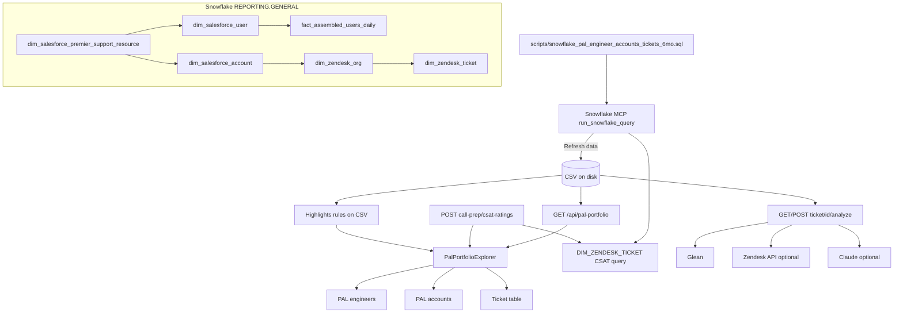

# PAL portfolio app — data sources

How data reaches the UI: where it comes from, which queries run, and what is **not** real-time.

Almost all portfolio UI data comes from **one flat CSV** on disk. The app does not maintain its own database. Ticket status and fields reflect the **Snowflake warehouse** at export time, not live Zendesk (expect hours of lag; **Refresh data** re-runs the export but is still not real-time).

---

## Shared foundation

| Step | What happens |
|------|----------------|
| **1. Snowflake (optional)** | **Refresh data** runs SQL via **Snowflake MCP** (`run_snowflake_query` → `uvx mcp-server-snowflake`). Implementation: `lib/snowflakeMcpClient.js`. |
| **2. SQL file** | `scripts/snowflake_pal_engineer_accounts_tickets_6mo.sql` in the repo parent (override: `PAL_PORTFOLIO_SNOWFLAKE_SQL_PATH`). |
| **3. CSV write** | Results written to `PAL_PORTFOLIO_CSV_PATH`, or the first existing portfolio CSV, or `../tmp_pal_engineer_accounts_tickets_last6mo.csv`. Implementation: `lib/palPortfolioSnowflakeExport.js`, API: `POST /api/pal-portfolio/refresh-from-snowflake`. |
| **4. App read** | Browser calls **`GET /api/pal-portfolio`** → `loadPalPortfolioRows()` in `lib/palPortfolio.js` reads the CSV; headers become camelCase (`PAL_LIAISON_EMAIL` → `palLiaisonEmail`). |

**CSV search order** (when `PAL_PORTFOLIO_CSV_PATH` is unset):

1. `pal-portfolio/data/pal_engineer_accounts_tickets_last6mo.csv` or `tmp_pal_engineer_accounts_tickets_last6mo.csv`
2. Same names under `pal-portfolio/`
3. Same names under repo root (`../`)

See `pal-portfolio/.env.example` for env vars (`PAL_PORTFOLIO_CSV_PATH`, `PAL_PORTFOLIO_TICKET_MONTHS`, Snowflake MCP, Glean, Zendesk, Anthropic).

---

## 1. PAL engineers (dropdown)

| | |
|--|--|
| **Source** | Same CSV as everything else — **no separate query or API**. |
| **How built** | Client-side in `components/PalPortfolioExplorer.js`: unique `palLiaisonEmail`; first row per email. |
| **Display label** | `palAssembledName` (Assembled PSE) if present, else `palLiaisonSfName`, plus email (`engineerLabel()`). |
| **Snowflake origin** | `pal_portfolio` CTE in `scripts/snowflake_pal_engineer_accounts_tickets_6mo.sql` |

```sql
FROM reporting.general.dim_salesforce_premier_support_resource psr
LEFT JOIN reporting.general.dim_salesforce_user lia
  ON psr.premier_support_liaison_salesforce_user_id = lia.id_case_sensitive
LEFT JOIN (
  SELECT * FROM reporting.general.fact_assembled_users_daily
  WHERE datadog_role_group IN (
    'Premier Support Engineering',
    'Premier Support Engineering Leadership'
  )
  QUALIFY ROW_NUMBER() OVER (PARTITION BY id ORDER BY data_date DESC) = 1
) asm ON lia.email = asm.email
```

**Exported columns:** `PAL_LIAISON_EMAIL`, `PAL_LIAISON_SF_NAME`, `PAL_ASSEMBLED_NAME`, `PAL_ZENDESK_USER_ID`, `PAL_ASSEMBLED_AGENT_ID`.

**Filter:** Active PSR rows only (`psr.end_date` logic in the SQL `WHERE` clause).

---

## 2. PAL accounts (dropdown)

| | |
|--|--|
| **Source** | Same CSV, filtered to the selected `palLiaisonEmail`. |
| **How built** | Client-side: unique `salesforceAccountId` for that engineer; `salesforceAccountName`, `datadogOrgId`, `zendeskOrgName` from export rows. |
| **Snowflake origin** | Same `pal_portfolio` CTE + account join |

```sql
INNER JOIN reporting.general.dim_salesforce_account acc
  ON psr.salesforce_account_id = acc.id
```

**Exported columns:** `SALESFORCE_ACCOUNT_ID`, `SALESFORCE_ACCOUNT_NAME`, `DATADOG_ORG_ID`, `ZENDESK_ORG_NAME`.

**KPI link (not the dropdown):** “KPI summary (Metabase)” is a constructed URL only — `lib/customerReportMetabaseUrl.js` → Metabase dashboard 54438 with `datadog_org_id`. No query from this app.

---

## 3. Ticket lists

### 3a. Main ticket table (grouped by status)

| | |
|--|--|
| **Source** | CSV rows matching selected `palLiaisonEmail` + `salesforceAccountId`. |
| **API** | `GET /api/pal-portfolio` (page load and after refresh). |
| **Snowflake SQL** (on **Refresh data**) | `pal_tickets_6mo` in `scripts/snowflake_pal_engineer_accounts_tickets_6mo.sql` |

```sql
FROM pal_portfolio pal
INNER JOIN reporting.general.dim_zendesk_org zo
  ON zo.salesforce_account_id = pal.salesforce_account_id
INNER JOIN reporting.general.dim_zendesk_ticket t
  ON t.zendesk_org_id = zo.id
  AND t.is_support_ticket = TRUE
  AND t.created_timestamp >= DATEADD(month, -6, CURRENT_TIMESTAMP())
QUALIFY ROW_NUMBER() OVER (
  PARTITION BY t.id, pal.pal_liaison_email
  ORDER BY pal.psr_id
) = 1
```

Default window is **6 months** (`PAL_PORTFOLIO_TICKET_MONTHS` can override the `-6` in SQL).

**Ticket columns from warehouse:** `ticket_id`, `ticket_created_timestamp`, `ticket_subject`, **`ticket_status`** (`t.status` in `dim_zendesk_ticket`), `ticket_custom_status_name`, `ticket_source`, premier flag, product, impact.

**Client-side only (not in SQL):**

- Created date filter: `rangeFrom` / `rangeTo` on `ticketCreatedTimestamp`.
- Terminal tickets: solved/closed/merged only if solved/updated within **30 days** of table **To**; **closed** hidden by default.
- Grouping and Open/New sort: `lib/palPortfolioTicketPrioritization.js` (`groupTicketsByStatus`, attention score).

**Status shown in UI:** Default `ticketStatus` from CSV → `TICKET_STATUS` in Snowflake (`t.status`). When **Glean** is configured and you are signed in, the app loads indexed Zendesk JSON via `POST /api/pal-portfolio/ticket-statuses-glean` (`gleanGetDocuments` on agent ticket URLs, up to 64 tickets). If Glean status differs from the export, the table shows **Glean** (small **G** marker; hover for export value). Implementation: `lib/gleanZendeskTicketStatus.js` (server), `lib/palPortfolioGleanStatusOverlay.js` (client overlay).

---

### 3b. Customer call prep — highlights

| Section | Source | Query |
|--------|--------|--------|
| Long-running, engineering, sentiment, resolution, feature requests, open bugs | **CSV** in highlights date window | **None** — `buildCustomerCallHighlights()` in `lib/palPortfolioCallHighlights.js` (rules on export fields/tags/dates). |
| **Bad / good CSAT** | **Runtime Snowflake** | `POST /api/pal-portfolio/call-prep/csat-ratings` → `fetchCsatHighlightsFromSnowflake()` in `lib/palPortfolioCsatSnowflake.js` |

**CSAT SQL** (two executions: `SATISFACTION_RATING_SCORE = 'bad'` and `'good'`):

```sql
SELECT
  t."ID" AS "TICKET_ID",
  t."SUBJECT", t."STATUS", t."CREATED_TIMESTAMP",
  t."SATISFACTION_RATING_COMMENT", t."SATISFACTION_RATING_REASON",
  t."RATING_COMMENT", t."DSAT_REASON", t."DSAT_REASON_COMMENT",
  t."PRIMARY_PRODUCT_COMPONENT",
  a."NAME" AS "ASSIGNEE_NAME"
FROM REPORTING.GENERAL."DIM_ZENDESK_TICKET" t
LEFT JOIN REPORTING.GENERAL."DIM_ZENDESK_USER" a ON t."ASSIGNEE_ID" = a."ID"
LEFT JOIN REPORTING.GENERAL."DIM_ZENDESK_ORG" org ON t."ZENDESK_ORG_ID" = org."ID"
WHERE t."IS_SUPPORT_TICKET" = TRUE
  AND t."SATISFACTION_RATING_SCORE" = 'bad'   -- or 'good'
  AND (datadog org + optional salesforce_account_id match)
  AND t."CREATED_TIMESTAMP" BETWEEN highlightFrom AND highlightTo
ORDER BY t."CREATED_TIMESTAMP" DESC
LIMIT 150
```

Runs via **Snowflake MCP**, not the portfolio CSV. FQN database/schema: `SNOWFLAKE_CSAT_DATABASE` / `SNOWFLAKE_CSAT_SCHEMA` (default `REPORTING` / `GENERAL`).

**Optional** (only if `ZENDESK_EMAIL` + `ZENDESK_API_TOKEN` are set):

| Feature | API | Data |
|--------|-----|------|
| Low sentiment (customer replies) | `POST /api/pal-portfolio/call-prep/scan-sentiment` | Live Zendesk public comments |
| FR-#### Jira links | `POST /api/pal-portfolio/call-prep/resolve-fr-jira` | Live `GET /api/v2/tickets/{id}.json` |

Without Zendesk API credentials, those use export data only or are skipped.

---

## 4. Ticket summarization (Briefing / ticket page)

**Endpoint:** `GET` or `POST` `/api/pal-portfolio/ticket/[ticketId]/analyze`  
**Route:** `app/api/pal-portfolio/ticket/[ticketId]/analyze/route.js`

### Step 0 — Export context (always)

| | |
|--|--|
| **Source** | Same CSV via `loadPalPortfolioRows()` |
| **Match** | Rows where `ticketId` equals the requested id |
| **Use** | Subject, status, account, product, etc. in the prompt |

Missing from CSV → **404 Ticket not found in export**.

### Step 1 — Summarization path

| Configuration | Path |
|---------------|------|
| `ANTHROPIC_API_KEY` set | **Claude** — `lib/claudeTicketAnalysis.js` or `lib/claudeGleanToolLoop.js` if `CLAUDE_GLEAN_TOOL_LOOP=true` |
| No Anthropic key | **Glean Chat** — `gleanChatTicketAnalysis()` in `lib/gleanServer.js` |
| Failure / no AI | **Export-only markdown** — `lib/ticketExportFallbackSummary.js` |

### Evidence for Claude summaries

| Evidence | How | Requires |
|----------|-----|----------|
| PAL export | CSV rows for ticket | CSV on disk |
| Glean company search | `gleanSearchForTicket()` → Glean REST search | `GLEAN_*` (+ OAuth or token) |
| Glean indexed Zendesk ticket | `fetchGleanZendeskTicketBundleForPrompt()` — getdocuments / MCP read_document | `GLEAN_*`, Zendesk agent URL prefix |
| Zendesk Support API | `fetchZendeskTicketBundleForPrompt()` — ticket + comments | `ZENDESK_EMAIL`, `ZENDESK_API_TOKEN`, `ZENDESK_SUBDOMAIN` |

Merged in `combineZendeskTicketBlocksForPrompt()` (`lib/gleanZendeskIndexFetch.js`). System prompt: `lib/datadogTicketInvestigationPrompt.js`.

**Glean-only path:** `buildGleanChatUserMessage()` in `lib/gleanPrompt.js` + optional Zendesk API block.

**Output:** Markdown investigation summary in the UI; cached in the browser tab until refresh.

---

## End-to-end flow



---

## Quick reference

| UI piece | Primary data | Snowflake / other |
|----------|----------------|-------------------|
| PAL engineers | CSV | `psr` + `lia` + `asm` in portfolio SQL |
| PAL accounts | CSV | `acc` + `zo` in portfolio SQL |
| Ticket table | CSV | `dim_zendesk_ticket` via portfolio SQL |
| Highlights (risk) | CSV + client rules | None |
| Highlights (CSAT) | Live query | `DIM_ZENDESK_TICKET` via Snowflake MCP |
| Briefing | CSV + Claude/Glean (+ optional Zendesk API) | Enrichment not from portfolio SQL |

---

## Files not used by default for main UI

These exist in the repo but are **not** loaded unless you set `PAL_PORTFOLIO_CSV_PATH` to them:

- `scripts/snowflake_pal_metabase_query.sql` — PSR/account metadata (Metabase-style), no ticket rows
- `scripts/snowflake_pal_account_tickets.sql` — richer per-ticket export (alternate schema)
- `tmp_pal_salesforce_psr_export.csv` — PSR roster only, no tickets

---

## Key code paths

| Concern | File |
|---------|------|
| CSV load / path resolution | `lib/palPortfolio.js` |
| Snowflake export + CSV write | `lib/palPortfolioSnowflakeExport.js` |
| Snowflake MCP client | `lib/snowflakeMcpClient.js` |
| CSAT highlights SQL | `lib/palPortfolioCsatSnowflake.js` |
| Call-prep highlight rules | `lib/palPortfolioCallHighlights.js` |
| Ticket grouping / attention | `lib/palPortfolioTicketPrioritization.js` |
| Main UI | `components/PalPortfolioExplorer.js` |
| Briefing API | `app/api/pal-portfolio/ticket/[ticketId]/analyze/route.js` |
